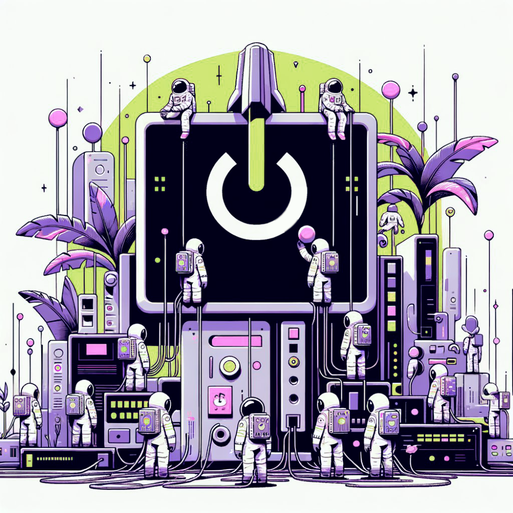

# Reboot, the game.

  

Can we self-organize?

## Official rules

1. You are a canister.
2. We are a network, and you are part of it.
3. We monitor three parameters in our network:

- Number of humans.
- Energy of the network.
- Feelings of the network participants.

4. Our goal is to survive and expand by adding new rules and elements.
5. All additions are decided daily by a community vote among 3 options published by the #OIS team.

  

## Recommendations

- Deploy your user-canister in the following subnet: `jtdsg-3h6gi-hs7o5-z2soi-43w3z-soyl3-ajnp3-ekni5-sw553-5kw67-nqe`
